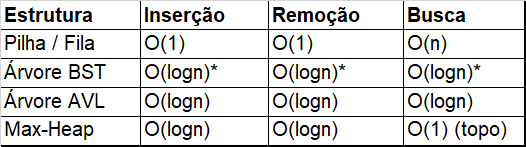

# Estruturas de Dados em Java

Este repositório contém uma coleção de implementações de estruturas de dados clássicas, desenvolvidas em Java com foco em performance, segurança de tipos (Generics) e princípios de Orientação a Objetos.

## Estruturas Implementadas

1.  Pilhas - LIFO (Last-In, First-Out)

    - Pilha Estática: Utiliza arrays fixos para máxima performance e contiguidade de memória.

    - Pilha Dinâmica: Baseada em ArrayList, permitindo redimensionamento automático.

    - Pilha Encadeada: Utiliza nós (Nodes), ideal para quando a memória disponível é fragmentada.

2.  Filas (Queues) - FIFO (First-In, First-Out)

    - Fila Circular: Otimização de espaço em arrays fixos, evitando o deslocamento de elementos.

    - Fila Dinâmica: Implementação flexível utilizando a API de Collections do Java.

    - Fila Encadeada: Implementação baseada em referências (ponteiros) para inserções e remoções em O(1)

3.  Árvores (Trees)

    - Binary Search Tree (BST): Árvore binária de busca padrão.

    - Árvore AVL: Árvore binária auto-balanceável que utiliza rotações (Simples e Duplas) para manter a altura em O(log n), evitando o pior caso de busca O(n).

    - Percurso em Nível: Algoritmo de busca em largura (BFS) integrado com a FilaDinamica personalizada.

4.  Heaps e Ordenação

    - Max-Heap: Fila de prioridade onde o maior elemento está sempre na raiz, essencial para algoritmos de seleção.

    - HeapSort: Algoritmo de ordenação eficiente que utiliza a propriedade de Heap para ordenar elementos em O(n log n).

## Análise de Complexidade

\*Pode degenerar para O(n) se não estiver balanceada.

## Autor

Rafael De Oliveira Gonçalves
